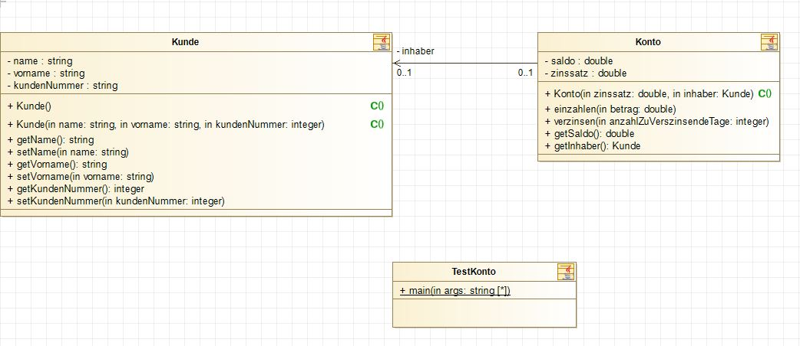

# Modul 226A - Klassenbasiert implementieren
## Kompetenz 2.1
Ich kann die statische Struktur eines klassenbasierten Programms mit einigen Klassen in einem UML Klassendiagramm dokumentieren.

### UML Klassendiagramme
> Um den Überblick zu wahren gibt es das UML-Klassendiagramm. Es zeigt, welche Klassen existieren und wie diese mit einander in Beziehung stehen und stellt somit eine Art „Landkarte“ eines klassenbasierten Programms dar.

#### Die UML Klasse
Eine UML-Klasse ist in drei Bereiche gegliedert:
- Name der Klasse
- Attribute der Klasse
- Konstruktoren und Operationen der Klasse

#### Sichtbarkeiten
Um die Sichtbarkeit darzustellen verwendet man in UML folgende Vorzeichen:
- **\-** bedeutet private
- **~** bedeutet package
- **\#** bedeutet protected
- **\+** bedeutet public

#### Beziehungen und Assoziationen
**Assoziation** bedeutet, dass zur Laufzeit zwischen Objekten der beteiligten Klassen eine **Beziehung** besteht.

Die **Aggregation** ist eine Form der Assoziation die aussagt, dass wenn das "ganze Objekt", welches eine Beziehung zum "Teilobjekt" hat, zerstört wird, das "Teilobjekt" weiterlebt.
Der leere Rhombus auf der Seite des Ganzen stellt eine Aggregation dar.

Eine **Komposition** ist eine Form der Assoziation die ausdrückt, dass die Lebensdauer der "Teilobjekte" an die Lebensdauer der "ganzen Objekte" gebunden ist. Stirbt das Ganze, so werden auch die Teilobjekte zerstört.
Die Komposition wird durch einen ausgefüllten Rhombus auf der Seite des Ganzen dargestellt und kann dort nur eine einfache Multiplizität haben.

Eine **Abhängigkeit** beschreibt, dass eine Klasse in irgendeiner Art eine andere Klasse benötigt. Das kann beispielsweise ein Aufruf einer Methode der anderen Klasse, in einer Methode der aufrufenden Klasse, sein.
Die Abhängigkeit wird durch einen gestrichelten Pfeil mit Stereotyp dargestellt.

## Reflexion zur Erarbeitung dieser Kompetenz

##### Welche neuen Erkenntnisse konnte ich gewinnen?
- Ich konnte mein Wissen zu den UML Assoziationen festigen. Ich weiss wie ich in UML eine Aggregation, eine Komposition und eine Abhängigkeit darstellen kann.

##### Was habe ich gut gemacht?
- Ich habe die Unterlagen zu dieser Kompetenz studiert und eine kleine Zusammenfassung zu einigen Punkten geschrieben.
- Ich habe alle Aufgaben im Arbeitsblatt durchgearbeitet.

##### Welche Schwierigkeiten gab es?
- Abgabe der Kompetenz folgt

##### Was kann ich nächstes Mal besser machen?
- Abgabe der Kompetenz folgt