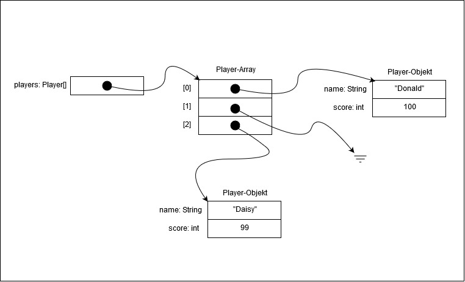

# Modul 226A - Klassenbasiert implementieren
## Kompetenz 2.2
Ich kann die Objektsituation eines klassenbasierten Programms zu einem bestimmten Zeitpunkt mit einem Speicherdiagramm erklären.

### Speicherdiagramme
> Oft ist es schwierig einen aktuellen Überblick über die bestehenden Objekte zu behalten. Mit
Hilfe eines Speicherdiagramms kann die aktuelle Situation der im Arbeitsspeicher
existierenden Objekte übersichtlich dargestellt werden.

#### Code für Speicherdiagramm
```
public class Player {
	private String name;
	private int score;

    public Player(String name) {
		this.name = name;
	}

	public void score(int s) {
		score += s;
	}
}

class TestPlayer {
	public static void main(String[] args) {
		Player p = new Player("Daisy");
		p.score(99);
		Player q = new Player("Donald");
		Player[] players = new Player[3];
		players[0] = q;
		players[2] = p;
		players[0].score(100); //<== Speicherdiagramm
	}
}
```
#### Speicherdiagramm



## Reflexion zur Erarbeitung dieser Kompetenz

##### Welche neuen Erkenntnisse konnte ich gewinnen?
- Speicherdiagramme habe ich bisher noch nicht gekannt. Ich denke, es kann praktisch sein Objekte Visuell darzustellen um eine Programmlogik zu verstehen.

##### Was habe ich gut gemacht?
- Ich habe die Unterlagen zu den Speicherdiagrammen studiert und anschliessend ein Diagramm für den vorgegebenen Code gezeichnet.

##### Welche Schwierigkeiten gab es?
- Ich musste genau schauen, wann etwas eine Variable und wann ein dazugehöriges Objekt gezeichnet wird.
- Ich habe vergessen, die Variablen `p:Player` und `q:Player` vergessen ins Speicherdiagramm einzuzeichnen.

##### Was kann ich nächstes Mal besser machen?
- Ich kann mich beim nächsten Mal besser Informieren, welche Angaben genau verlangt werden.