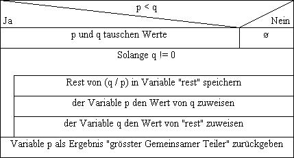

# Modul 226A - Klassenbasiert implementieren
## Kompetenz 3.2.2
Ich kann alle in Java vorkommenden Kontrollanweisungen zweckgerecht einsetzen.

#### Beispiele einiger Kontrollanweisungen

Die nachfolgenden Beispiele finden Sie auch im Projekt [Kontrollstrukturen](../Projekte/kontrollstrukturen).

#### Dreieck aus Sternen ausgeben
Um ein Dreieck aus Sternen auszugeben verwende ich 2 **FOR-Schleifen** für die Kontrollanweisungen.
```
private static void printTriangle(int height) {
	for (int i = 1; i <= height; i++) {
		StringBuilder line = new StringBuilder();
		for (int j = 0; j < i; j++) {
			line.append("*");
		}
		System.out.println(line);
	}
}
```
Ausgabe bei `printTriangle(8);`:
```
*
**
***
****
*****
******
*******
********
```

##### Grösster gemeinsamer Teiler finden
Folgendes Struktogramm habe ich im Code umgesetzt:





Für die Berrechnung des grössten gemeinsamen Teilers verwende ich eine **IF-Anweisung** und eine **WHILE-Schleife**:
```
private static int greatestCommonDivisor(int p, int q) {
	if (p < q) {
		int cache = p;
		p = q;
		q = cache;
	}
	while (q != 0) {
		int remaining = p % q;
		p = q;
		q = remaining;
	}
	return p;
}
```
Ausgabe bei `System.out.println(greatestCommonDivisor(20, 15));`:
```
5
```

##### XOAufgabe
> Auf 10 Zeilen sollen jeweils 10 Zeichen ("X" oder "O") ausgegeben werden. Dabei
soll die Anzahl der auszugebenden X durch Zufall bestimmt werden. Die Anzahl X
soll zwischen 1 und 4 variieren. Als erstes Zeichen soll immer ein X ausgegeben
werden. Die weiteren X sollen möglichst gleichmässig verteilt werden. Ihr
Programm soll dazu berechnenen, wieviele O hierzu zwischen zwei X stehen
müssen. Am Schluss soll das Programm die Zeile mit O auf 10 Zeichen auffüllen.

Diese Aufgabe habe ich mit 3 bzw. 4 **FOR-Schleifen** gelöst:

```
private static void printRandomLines(int times) {
	for (int i = 0; i < times; i++) {
		System.out.println("Zeile " + (i + 1) + ": " + getRandomLine());
	}
}

private static String getRandomLine() {
	int randomInt = random.nextInt(4) + 1;
	StringBuilder line = new StringBuilder("Zufallszahl: " + randomInt + " ");
	int numberOfOsBetween = 10 / randomInt - 1;
	for (int i = 0; i < randomInt; i++) {
		line.append("X");
		for (int j = 0; j < numberOfOsBetween; j++) {
			line.append("O");
		}
	}
	for (int i = 0; i < 10 - (randomInt * (numberOfOsBetween + 1)); i++) {
		line.append("O");
	}
	return line.toString();
}
```
Ausgabe bei `printRandomLines(10);`:
```
Zeile 1: Zufallszahl: 2 XOOOOXOOOO
Zeile 2: Zufallszahl: 4 XOXOXOXOOO
Zeile 3: Zufallszahl: 3 XOOXOOXOOO
Zeile 4: Zufallszahl: 1 XOOOOOOOOO
Zeile 5: Zufallszahl: 3 XOOXOOXOOO
Zeile 6: Zufallszahl: 4 XOXOXOXOOO
Zeile 7: Zufallszahl: 3 XOOXOOXOOO
Zeile 8: Zufallszahl: 3 XOOXOOXOOO
Zeile 9: Zufallszahl: 4 XOXOXOXOOO
Zeile 10: Zufallszahl: 4 XOXOXOXOOO
```

## Reflexion zur Erarbeitung dieser Kompetenz

##### Welche neuen Erkenntnisse konnte ich gewinnen?
- folgt

##### Was habe ich gut gemacht?
- folgt

##### Welche Schwierigkeiten gab es?
- folgt

##### Was kann ich nächstes Mal besser machen?
- folgt
