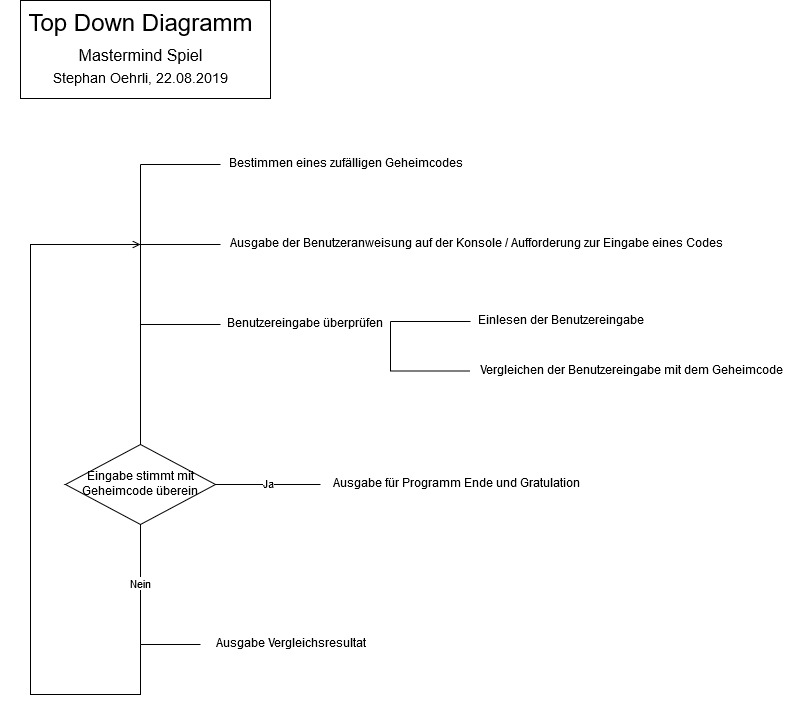

# Modul 226A - Klassenbasiert implementieren
## Kompetenz 3.2.2
Ich kann ein grösseres Problem in Teilprobleme zerlegen und diese mittels Java-Methoden lösen (teile und herrsche).

#### Datentypen / Datenstruktur für das Programm Mastermind
Wir entscheiden uns, folgende Datentypen für das Programm Mastermind zu verwenden:
- Geheimcode soll als String Array gespeichert werden.
- Nutzereingabe wird zu String Array geparst.
- Anweisungen und Konsolenausgaben als String.

#### Top Down Diagramm

## Reflexion zur Erarbeitung dieser Kompetenz

##### Welche neuen Erkenntnisse konnte ich gewinnen?
- Das Top Down Diagramm hilft mir dabei, ein grosses, abstraktes Problem in kleine, konkrete Probleme zu zerlegen. Die einzelnen Punkte im Diagramms können Methoden des Programms darstellen.

##### Was habe ich gut gemacht?
- Ich habe mir das Video in den Unterlagen zum Thema "Top Down Diagramme" angesehen.
- Ich habe ein Top Down Diagramm für das Mastermind Spiel erstellt.

##### Welche Schwierigkeiten gab es?
- folgt

##### Was kann ich nächstes Mal besser machen?
- folgt